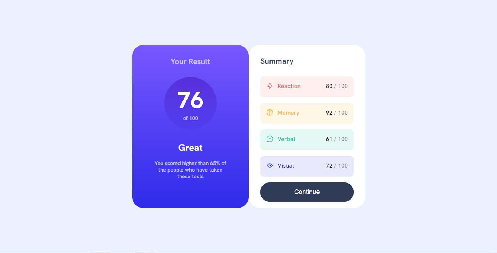
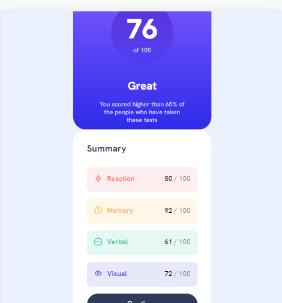

# Frontend Mentor - Results summary component solution

This is a solution to the [Results summary component challenge on Frontend Mentor](https://www.frontendmentor.io/challenges/results-summary-component-CE_K6s0maV). Frontend Mentor challenges help you improve your coding skills by building realistic projects. 

## Table of contents

- [Overview](#overview)
  - [The challenge](#the-challenge)
  - [Screenshot](#screenshot)
  - [Links](#links)
- [My process](#my-process)
  - [Built with](#built-with)
  - [What I learned](#what-i-learned)
  - [Continued development](#continued-development)
- [Author](#author)

## Overview

### The challenge

Users should be able to:

- View the optimal layout for the interface depending on their device's screen size
- See hover and focus states for all interactive elements on the page

### Screenshot





### Links

- Live Site URL: [Results Summary](https://kushagarwal11ag.github.io/Results-Summary/)

## My process

### Built with

- Semantic HTML5 markup
- CSS custom properties
- Flexbox

### What I learned

Learned how to use existing knowledge in how to better design the website. Focused more on using 'rem' unit so that website will easily be responsive.

Learned linear gradient feature and how to effectively apply gradients to the website.
Below is a code snippet of the said feature


```css
.left-container {
  background-image: linear-gradient(hsl(252, 100%, 67%), hsl(241, 81%, 54%));
}
```

### Continued development

Centering elements vertically is still an issue I'm facing, for which the content will still be responsive.

## Author

- Frontend Mentor - [@kushagarwal11ag](https://www.frontendmentor.io/profile/kushagarwal11ag)
